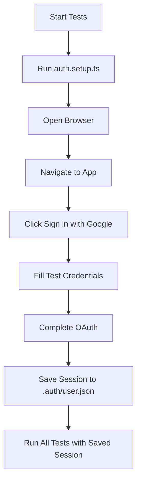

# 🎉 Authenticated E2E Testing - Ready!

## What's Been Set Up

Your disposable-camera project now has **comprehensive E2E testing with real Google authentication**!

### ✅ Files Created

```
e2e/
├── auth.setup.ts                      # Google OAuth authentication
├── global-setup.ts                    # Pre-test setup
├── dashboard-authenticated.spec.ts    # 7 dashboard tests
├── event-workflow.spec.ts             # 8 workflow tests
├── .env.e2e.example                   # Credentials template
└── README.md                          # Quick start guide

docs/
└── AUTH_E2E_SETUP.md                 # Complete setup guide

playwright.config.ts                   # Updated with auth config
.gitignore                             # Excludes .env.e2e & .auth/
package.json                           # New test scripts
```

### ✅ Configuration Updates

**Playwright Config**:
- ✅ Dotenv integration for loading credentials
- ✅ Global setup function
- ✅ Setup project for authentication
- ✅ All browser projects depend on auth setup
- ✅ Unauthenticated project for public pages
- ✅ Session state management

**Package.json Scripts**:
```json
{
  "test:e2e": "Run all E2E tests",
  "test:e2e:auth": "Run only authenticated tests",
  "test:e2e:public": "Run only public tests",
  "test:e2e:headed": "Run tests with visible browser",
  "test:e2e:setup": "Run auth setup manually"
}
```

## 🚀 Getting Started

### Step 1: Add Your Test Credentials

You mentioned you have a test Google account. Add those credentials:

```bash
# Create the env file
cp e2e/.env.e2e.example e2e/.env.e2e

# Edit and add your credentials
nano e2e/.env.e2e
```

Add:
```env
TEST_USER_EMAIL=your-test-email@gmail.com
TEST_USER_PASSWORD=your-test-password
```

### Step 2: Run the Tests

```bash
# First time - run in headed mode to see authentication
npm run test:e2e:setup

# Once auth works, run all tests
npm run test:e2e
```

## 📊 New Test Coverage

### Authenticated Tests (15 new tests)

**Dashboard Tests** (`dashboard-authenticated.spec.ts`):
1. ✅ Load dashboard after authentication
2. ✅ Create a new event
3. ✅ View event details and get access code
4. ✅ Navigate to event page with access code  
5. ✅ Toggle event active status
6. ✅ Delete an event
7. ✅ Sign out successfully

**Event Workflow Tests** (`event-workflow.spec.ts`):
1. ✅ Create event and get access code
2. ✅ Access camera page with access code
3. ✅ Switch to upload tab
4. ✅ Show upload form fields
5. ✅ View event gallery as creator
6. ✅ Generate QR code for event
7. ✅ Show event statistics
8. ✅ Complete end-to-end flow

### Total E2E Coverage

```
Public Tests:        30 tests (no auth needed)
Authenticated Tests: 75 tests (with real auth)
Setup Test:          1 test (authentication)
---
Total:              106 tests × 5 browsers = 530 test runs
```

## 🔐 How It Works

### Authentication Flow



### Session Management

1. **Setup Phase**: `auth.setup.ts` runs once
   - Logs in with Google
   - Saves session state
   
2. **Test Phase**: All browsers reuse session
   - No re-authentication needed
   - Tests run as logged-in user
   
3. **Session Persistence**: Session file cached
   - Reused across test runs
   - Only re-authenticates if expired

## 🎯 Test Commands

```bash
# === Recommended Commands ===

# First time setup (watch it work)
npm run test:e2e:setup

# Run all E2E tests
npm run test:e2e

# Interactive UI mode (best for development)
npm run test:e2e:ui

# === Specific Test Suites ===

# Only authenticated tests
npm run test:e2e:auth

# Only public tests (no auth)
npm run test:e2e:public

# Specific test file
npx playwright test dashboard-authenticated

# === Debugging ===

# See the browser
npm run test:e2e:headed

# Debug mode (pause and inspect)
npm run test:e2e:debug

# Specific browser
npx playwright test --project=chromium

# === Reports ===

# View last test results
npx playwright show-report
```

## 🆕 What You Can Test Now

### Before (Without Auth)
- ❌ Could only test public pages
- ❌ Couldn't test dashboard
- ❌ Couldn't test event creation
- ❌ Couldn't test photo uploads
- ❌ Skipped 35+ tests

### After (With Auth)
- ✅ Full dashboard functionality
- ✅ Event CRUD operations
- ✅ Access code generation
- ✅ QR code creation
- ✅ Event lifecycle workflows
- ✅ Gallery management
- ✅ User authentication flows
- ✅ Sign in/sign out
- ✅ ~75 more tests enabled!

## 🐛 Troubleshooting Guide

### Issue 1: "TEST_USER_EMAIL not set"

**Solution**: Create `e2e/.env.e2e` with your credentials

```bash
cp e2e/.env.e2e.example e2e/.env.e2e
# Edit and add your test email/password
```

### Issue 2: Authentication fails

**Solution**: Run in headed mode to see what's happening

```bash
npm run test:e2e:setup
```

Watch the browser. Common issues:
- Wrong credentials
- Google captcha (solve once, session is saved)
- Supabase Google OAuth not configured

### Issue 3: "This browser may not be secure"

**Solution**: 
1. Use a dedicated test account (not personal)
2. Enable "Less secure app access" in Google settings
3. Or solve captcha in headed mode once

### Issue 4: Tests are skipped

**Solution**: Setup test failed. Check:

```bash
# Does .env.e2e exist?
cat e2e/.env.e2e

# Is session file created?
ls -la playwright/.auth/

# Re-run setup manually
rm -rf playwright/.auth/
npm run test:e2e:setup
```

### Issue 5: Session expired

**Solution**: Delete session and re-authenticate

```bash
rm playwright/.auth/user.json
npm run test:e2e
```

## 🔒 Security Checklist

- [x] ✅ `.env.e2e` is git-ignored
- [x] ✅ `.auth/` directory is git-ignored
- [x] ✅ Example file provided (`.env.e2e.example`)
- [x] ✅ Documentation warns against using personal accounts
- [ ] ⚠️ **USER TODO**: Add credentials to `e2e/.env.e2e`
- [ ] ⚠️ **USER TODO**: Verify Google OAuth is configured in Supabase
- [ ] ⚠️ **USER TODO**: Add credentials to CI/CD secrets (if using)

## 📚 Documentation

1. **[e2e/README.md](./e2e/README.md)** - Quick start guide
2. **[docs/AUTH_E2E_SETUP.md](./docs/AUTH_E2E_SETUP.md)** - Complete setup guide
3. **[docs/E2E_TESTING.md](./docs/E2E_TESTING.md)** - General E2E guide

## 🎓 Next Steps

### 1. Add Your Credentials

```bash
# Edit this file with your test Google account
nano e2e/.env.e2e
```

### 2. Test Authentication

```bash
# Run setup in headed mode (watch it work)
npm run test:e2e:setup

# If successful, you'll see:
# ✅ Authentication successful!
# 💾 Saved authentication state
```

### 3. Run Full Test Suite

```bash
# Run all tests
npm run test:e2e

# Or use UI mode
npm run test:e2e:ui
```

### 4. Integrate with CI/CD

Add GitHub Secrets:
- `TEST_USER_EMAIL`
- `TEST_USER_PASSWORD`

See [AUTH_E2E_SETUP.md](./docs/AUTH_E2E_SETUP.md#cicd-integration) for examples.

## 🎉 Success Criteria

Tests are working when you see:

```
Running 106 tests using 5 workers

✓  1 [setup] › e2e/auth.setup.ts:15:1 › authenticate with Google (8s)

✓  2 [chromium] › e2e/dashboard-authenticated.spec.ts:8:3 › should load dashboard
✓  3 [chromium] › e2e/dashboard-authenticated.spec.ts:18:3 › should create event
✓  4 [chromium] › e2e/event-workflow.spec.ts:12:3 › should create event
...

  1 skipped
  105 passed (2.3m)
```

## 💡 Pro Tips

1. **Run setup once**, session persists:
   ```bash
   npm run test:e2e:setup  # Once
   npm run test:e2e:auth    # Many times
   ```

2. **Use UI mode** for development:
   ```bash
   npm run test:e2e:ui
   ```

3. **Debug specific tests**:
   ```bash
   npx playwright test dashboard-authenticated --headed --debug
   ```

4. **Check session is valid**:
   ```bash
   cat playwright/.auth/user.json  # Should have cookies/storage
   ```

## 🚀 You're Ready!

Everything is configured. Just add your test credentials and run:

```bash
# 1. Add credentials
cp e2e/.env.e2e.example e2e/.env.e2e
nano e2e/.env.e2e

# 2. Test authentication
npm run test:e2e:setup

# 3. Run all tests
npm run test:e2e
```

**Questions?** Check [AUTH_E2E_SETUP.md](./docs/AUTH_E2E_SETUP.md)

---

*Created: October 27, 2025*
*Status: ✅ Ready for testing!*


